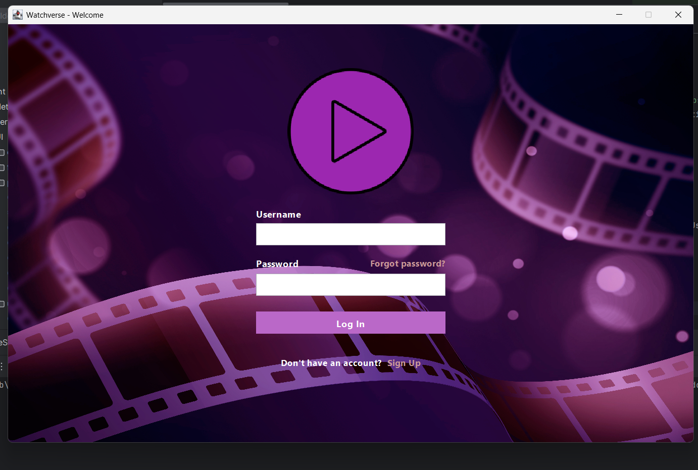
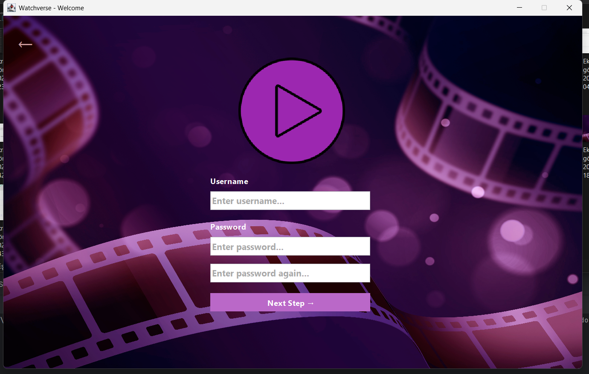
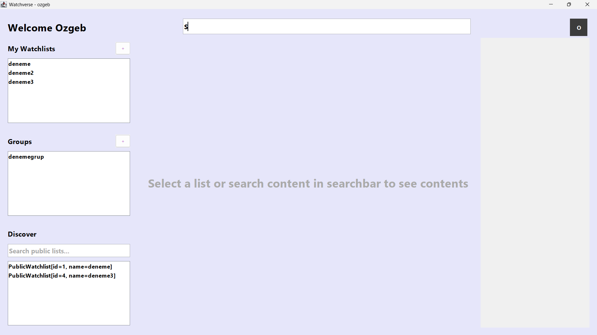
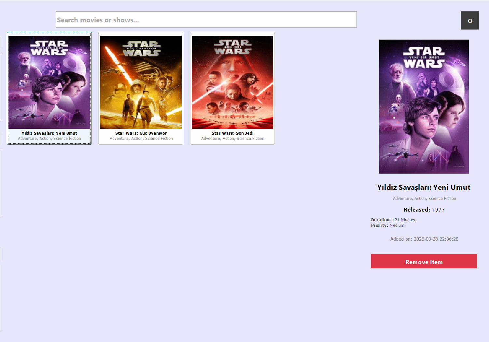
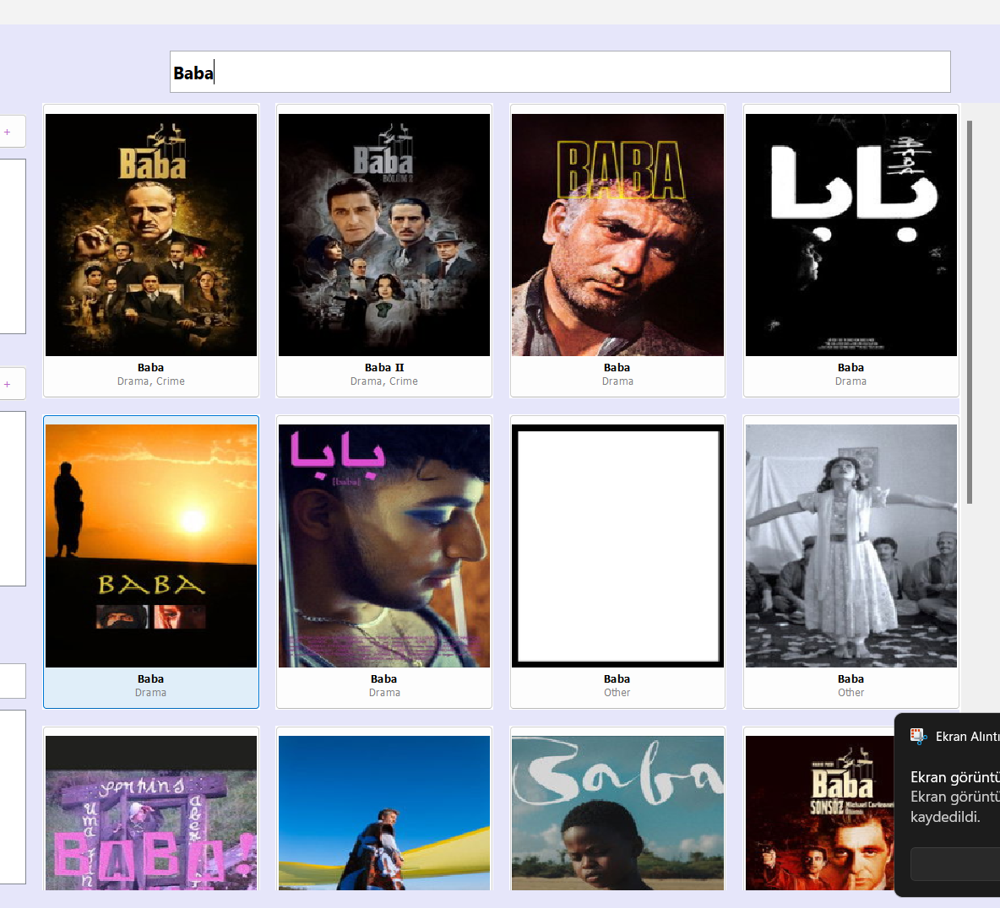
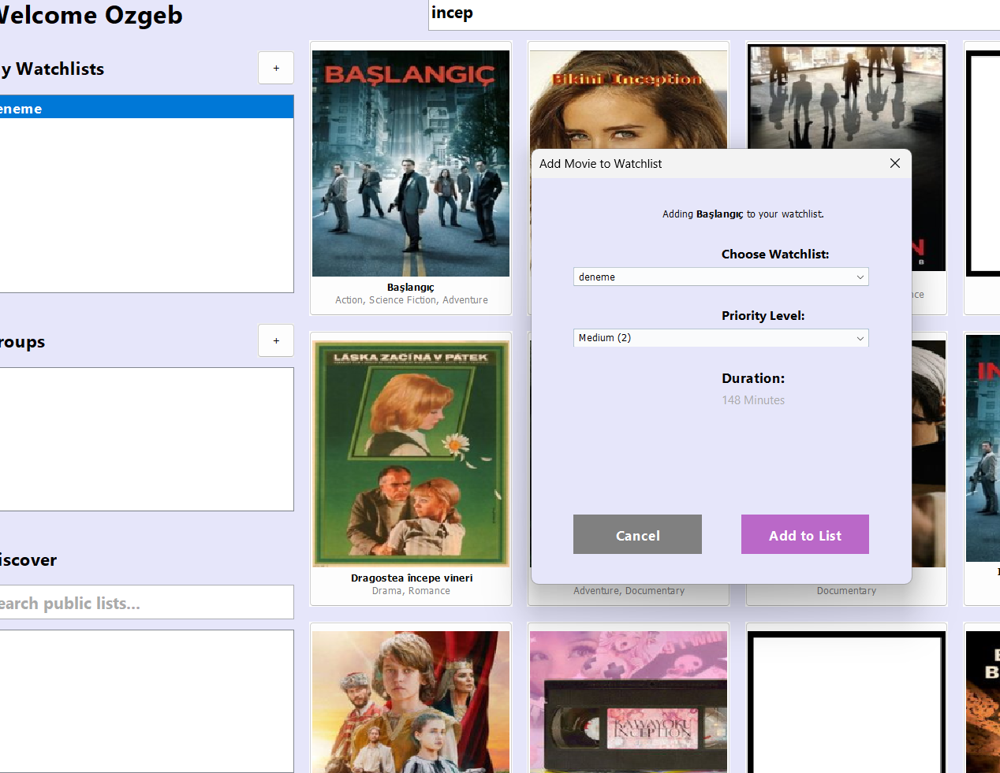
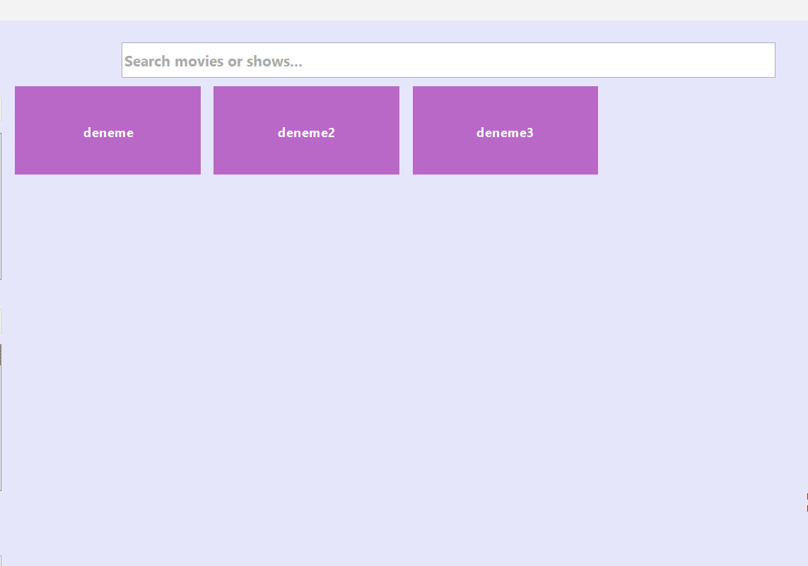

# 🎬 Watchverse: Social Media & Media Tracking System

Watchverse is a full-stack, multi-user media tracking and social interaction platform built with **Java**. It allows users to manage personalized watchlists, create movie/TV show groups with friends, and discover public lists in real-time.

---

## 🚀 Features

* **Real-time Communication:** Multi-threaded Client-Server architecture using **Java Sockets**.
* **Dynamic Content:** Integration with **TMDb API** for up-to-date movie and TV show data.
* **Social Groups:** Create or join groups using unique invite codes to share watchlists with friends.
* **Smart Prioritization:** Custom algorithm to sort media based on priority and duration.
* **Persistent Storage:** Lightweight and efficient data management using **SQLite**.
* **Secure Access:** User authentication system with custom Regex-based validation.

---

## 🛠️ Tech Stack

* **Language:** Java (JDK 17+)
* **UI Framework:** Java Swing (Custom Flat/Modern Design)
* **Networking:** Java Sockets (TCP/IP) & Multithreading
* **Database:** SQLite (Relational)
* **Architecture:** Layered Architecture (DAO, Service, UI Components)
* **Build Tool:** Maven (Optional / Project Structure)

---

## 📸 Screenshots

<p align="center">
  
  
  
  
  
  
  
</p>
<p align="center">
</p>

---

## ⚙️ Installation & Setup

Since the project uses **SQLite**, the database setup is automated. The system will create the `watchverse.db` file automatically on the first run.

### 1. Prerequisites
* Ensure you have **JDK 17** or higher installed.
* An IDE (IntelliJ IDEA, Eclipse, or NetBeans).

### 2. Running the Application
To ensure the system works correctly, follow this specific order:

1.  **Start the Server:**
    Run the `WatchverseServer.java` class located in the `Server` package. This initializes the socket listener and database connection.
    
2.  **Launch the Client:**
    Run the `Launcher.java` class located in the `Client` package. This class starts the app and ve opens the Login Panel.

---

## 🏗️ Project Structure

```text
src/
├── Database/          # DatabaseManager & DAO (Data Access Objects)
├── Model/             # Data models (Item, User, PublicWatchlist)
├── Server/            # Socket Server logic & Client Handlers
└── Client/            # UI Panels, Components, and Socket Manager
